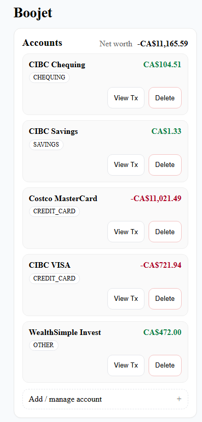
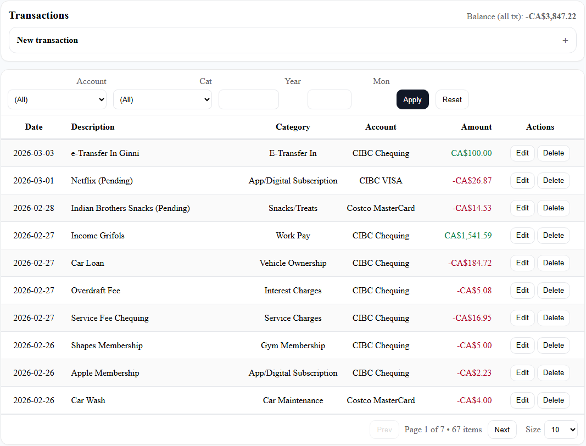
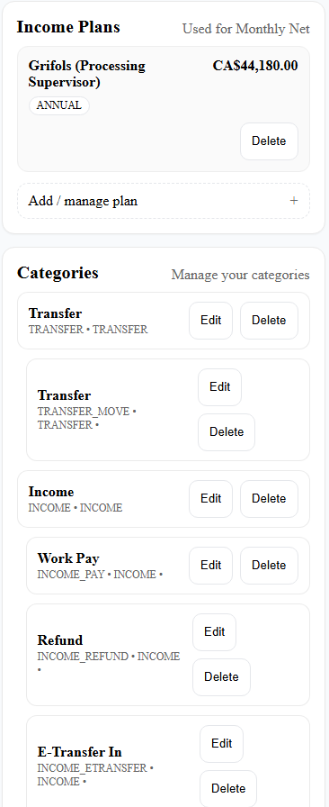
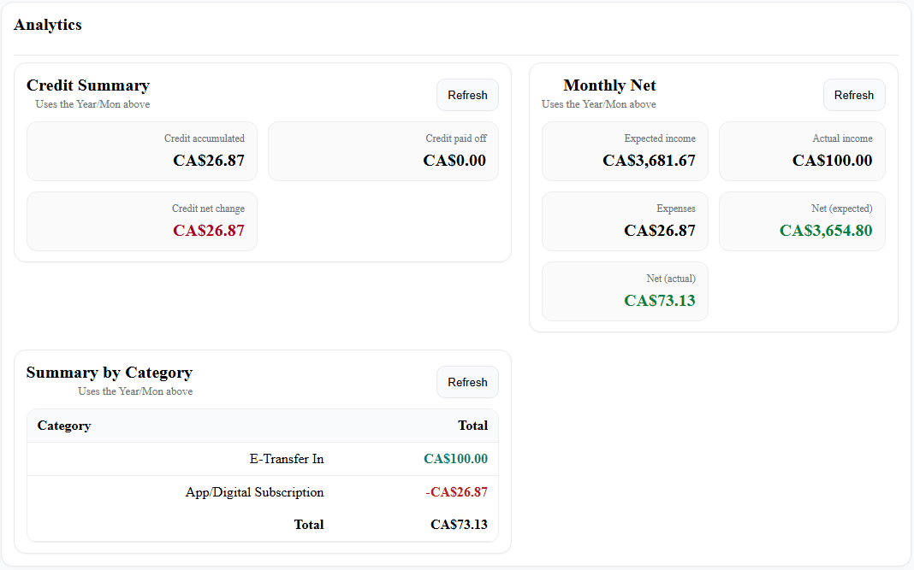

# Boojet — Personal Budgeting API

Boojet is a personal budgeting backend built with Java and Spring Boot. It exposes a REST API to record transactions across multiple accounts, categorize spending, and generate monthly summaries and insights. It also includes a lightweight static web UI for quick interaction.

## Features

### Transactions
- CRUD at `/transactions`
- **Supports Transfers** (move money between accounts or pay credit cards)
  - Transfer transactions include **from account** (`accountId`) and **to account** (`toAccountId`)
  - Transfers are represented using `CategoryType.TRANSFER`
- Search & filters:
  - Filter by account, category, year/month
  - Pagination support

### Accounts
- Group transactions under different accounts (CHEQUING, SAVINGS, CREDIT_CARD, etc.) to keep track of balances and spending per account
- Account totals update automatically based on transactions
- **Account Snapshots** allow user to set and adjust account balances at specific points in time to correct for discrepancies and ensure accurate tracking

### Categories
- System-defined categories (FOOD, RENT, UTILITIES, INCOME, TRANSFER, etc.)
- Gives user full flexibility to create/edit/define their own categories and subcategories
- Category types: `EXPENSE`, `INCOME`, `TRANSFER`
- Summary by Categories allows user to see where their money is going each month and identify areas for improvement

### Income Planning
- Define income plans at `/plan`
- Monthly Net widget compares expected income vs actual income and expenses

### Credit Insights
- Monthly credit metrics endpoint:
  - `GET /insights/credit/monthly?year=YYYY&month=M`
  - Returns:
    - **credit accumulated** (spending on credit cards)
    - **credit paid off** (payments to credit cards via transfers)
    - **net change** (accumulated − paid off)
    - optional per-card breakdown (`byCard`)

### Static Web UI
- Basic HTML/JS UI for quick interaction
- Supports:
  - accounts
  - categories (modal picker)
  - transactions (including transfers with From/To accounts)
  - monthly net + summary by category
  - credit monthly metrics

### Data Persistence
- PostgreSQL database (Docker Compose for local dev)
- Flyway migrations


## Tech Stack

- Java 21, Maven
- Spring Boot 3.5.x (Web, Data JPA, Validation)
- PostgreSQL (Docker Compose for local dev)
- Lombok, Jackson
- JUnit 5
- Flyway (migrations)

## Project Structure

Boojet is currently maintained as a single Spring Boot application.

```text
Boojet/
├── pom.xml                     # Maven project configuration
├── mvnw / mvnw.cmd             # Maven wrapper scripts
├── docker-compose.yml          # Local PostgreSQL container setup
├── src/
│   ├── main/
│   │   ├── java/               # Spring Boot backend source code
│   │   └── resources/
│   │       ├── application.properties
│   │       ├── db/migration/   # Flyway database migrations
│   │       └── static/         # Vanilla HTML/CSS/JS frontend
│   └── test/
│       ├── java/               # Unit and integration tests
│       └── resources/          # Test configuration/resources
├── docs/                       # Architecture, API, and testing documentation
└── README.md
```

The frontend is currently served by Spring Boot from src/main/resources/static.

The backend uses:

Java 21
Spring Boot
Maven
PostgreSQL
Flyway
JPA/Hibernate

For database schema changes, use Flyway migrations instead of relying on Hibernate auto-update.

## Branch Strategy

Boojet uses a simple stable-development branching model:

main
  Stable, runnable version of the app.

develop
  Integration branch for completed features before they are promoted to main.

feature/*
  Active feature work.

feat/*
  Smaller feature branches.

refactor/*
  Code cleanup or restructuring branches.

test/*
  Test-related branches.

ui/*
  Frontend/UI-focused branches.

Recommended flow:

feature branch → develop → main

## Running Boojet with Docker

Boojet can be run in two local modes.

### Option 1: Run only PostgreSQL in Docker

Start the database:

```bash
docker compose up -d db
```

Run the Spring Boot app locally:

```bash
./mvnw spring-boot:run
```

On Windows PowerShell:

```powershell
.\mvnw.cmd spring-boot:run
```

The app should be available at:

```text
http://localhost:8080/boojet.html
```

### Option 2: Run PostgreSQL and Spring Boot with Docker

Build and start the full stack:

```bash
docker compose up --build -d
```

Check containers:

```bash
docker ps
```

View backend logs:

```bash
docker compose logs app
```

Stop containers:

```bash
docker compose down
```

Reset the local database volume:

```bash
docker compose down -v
```

Only reset the volume if you are okay losing local development database data.


## Screenshots

- **Accounts View:**



- **Transactions View:**



- **Income Planning & Category Manager View:**



- **Analytics View:**




## Docs

- Architecture Overview[Outdated]: [Architecture Diagram](docs/architecture.md)
- API Docs: [API Documentation](docs/api.md)
- Testing Strategy: [Testing Documentation](docs/testing.md)


## Future Improvements

- API ergonomics: ~~pagination~~/sorting; query params for filters
- Analytics/insights: more metrics and graphing
- Features: recurring transactions, budgets/alerts, more account types (investments, loans), CSV import/export
- Documentation/ops: ~~OpenAPI/Swagger~~; Actuator health/info
- Validation/errors: bean validation + ~~centralized error handling~~
- Data layer: ~~more aggregate queries in repositories~~
- ~~Migrations: Flyway/Liquibase (avoid `ddl-auto` in prod)~~
- Security: Spring Security and CORS tuning
- Frontend: richer UI and charts; budgets/targets
- More automated tests (controller/service level)


## Why I Built This
I wanted to built something useful for myself. Boojet helps me track spending, understand where money goes, and stay on top of credit card debt and payoff patterns. It’s also a portfolio-quality Spring Boot project that mirrors real-world patterns (DTOs, migrations, aggregate queries, and a small UI).
