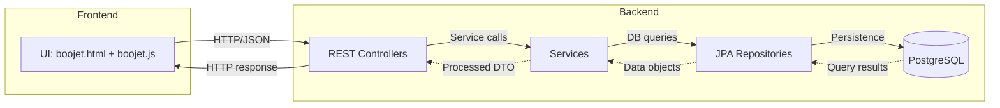
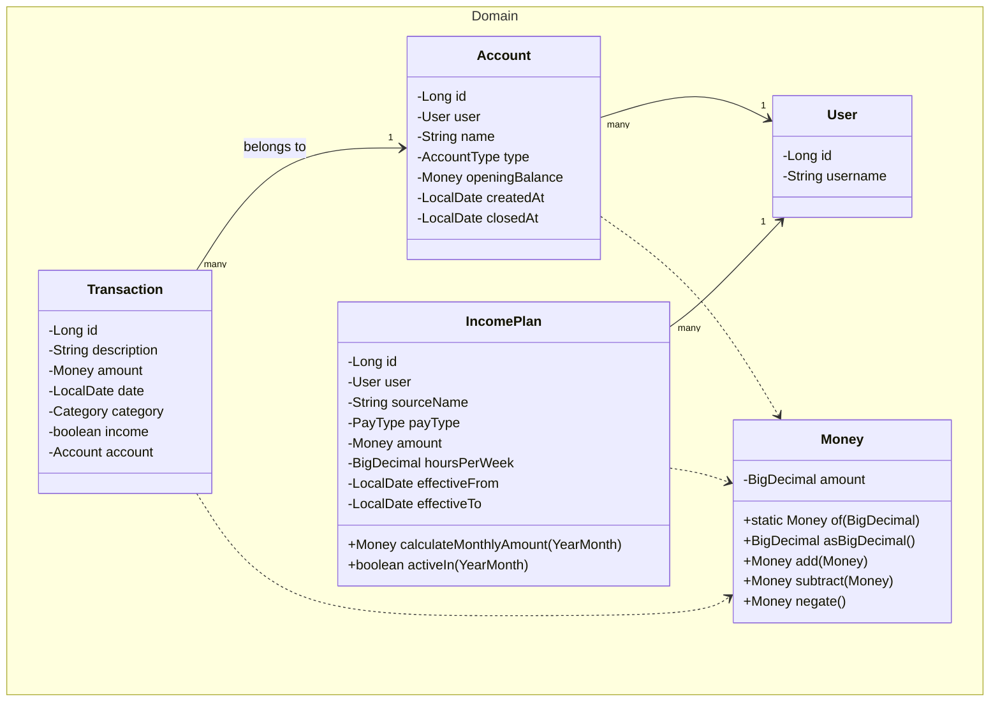
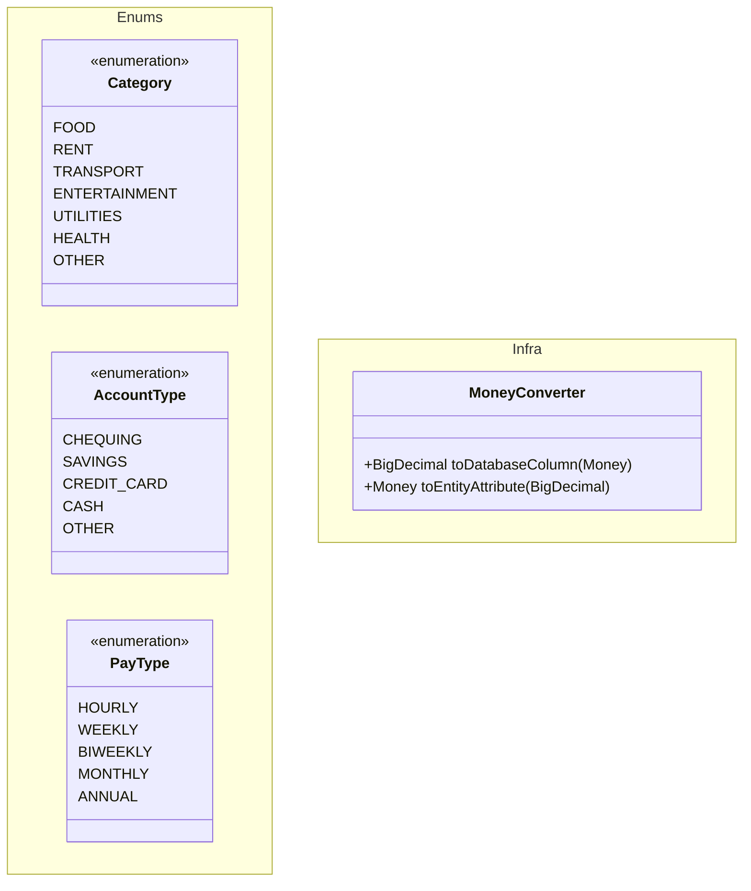
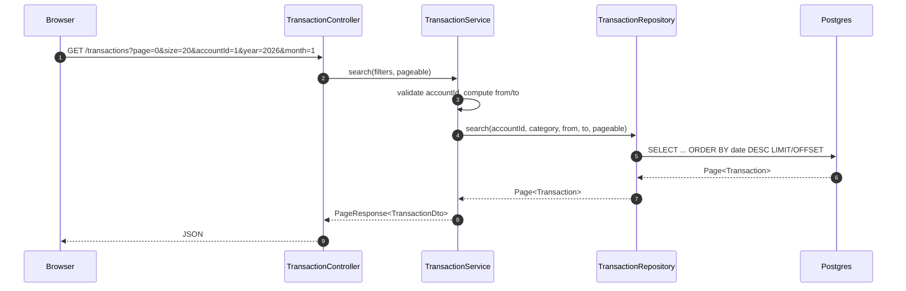
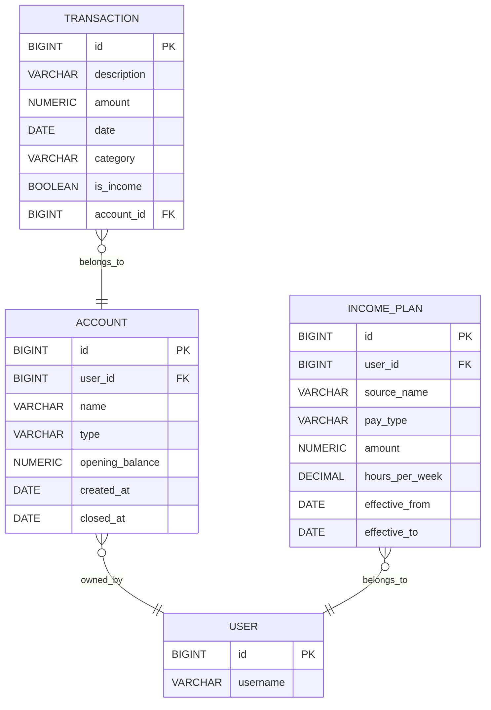

# Architecture Overview
 
 Boojet is a layered Spring Boot app: **Controllers -> Services -> Repositories -> PostgreSQL Database**, with a simple static web UI to access the API.

## Layers
- **UI:** A simple static HTML/JS interface to interact with the API.
- **Controllers:** Handle HTTP requests, map endpoints to service methods, and return responses.
- **Services:** Contain business logic, process data, and interact with repositories.
- **Repositories:** Interface with the PostgreSQL database using Spring Data JPA.
- **Database:** PostgreSQL stores users, accounts, transactions, and income plans. Enums (Category, AccountType, PayType) are stored as strings.

## Domain Model

## Request Flow

## Persistence Model

### Tables

### Indexes
Boojet uses a few small, targeted indexes to keep the most common reads fast (paging by account + date; preventing duplicate account names per user).

| Table          | Index name                 | Columns / Type               | Purpose                                                                     |
| -------------- | -------------------------- | ---------------------------- | --------------------------------------------------------------------------- |
| `transactions` | `transactions_pkey`        | `id` (btree, PK)             | Primary key.                                                                |
| `transactions` | `idx_tx_account_date_desc` | `(account_id, date DESC)`    | Speeds up paged lists like: filter by account and month, order by date desc.   |
| `accounts`     | `accounts_pkey`            | `id` (btree, PK)             | Primary key.                                                                |
| `accounts`     | `uq_accounts_user_name`    | `(user_id, name)` **UNIQUE** | One account name per user; prevents duplicates (e.g., two “Main” accounts). |
| `users`        | `users_pkey`               | `id` (btree, PK)             | Primary key.                                                                |
| `income_plans` | `income_plans_pkey`        | `id` (btree, PK)             | Primary key.                                                                |
