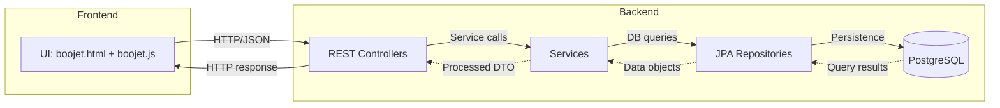
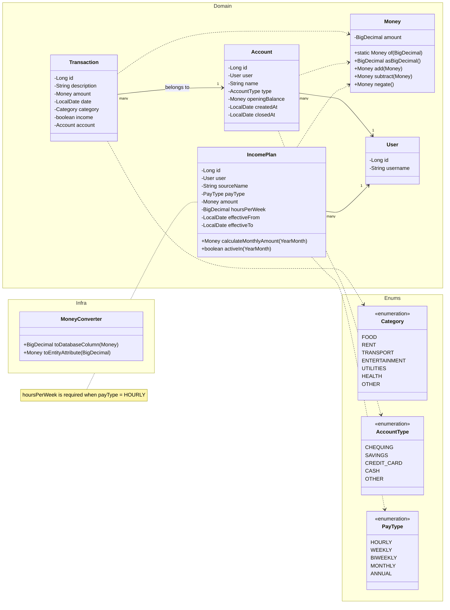

# Architecture Overview
 
 Boojet is a layered Spring Boot app: **Controllers -> Services -> Repositories -> PostgreSQL Database**, with a simple static web UI to access the API.

## Layers
- **UI:** A simple static HTML/JS interface to interact with the API.
- **Controllers:** Handle HTTP requests, map endpoints to service methods, and return responses.
- **Services:** Contain business logic, process data, and interact with repositories.
- **Repositories:** Interface with the PostgreSQL database using Spring Data JPA.
- **Database:** PostgreSQL stores accounts, transactions, and categories.

## Domain Model

